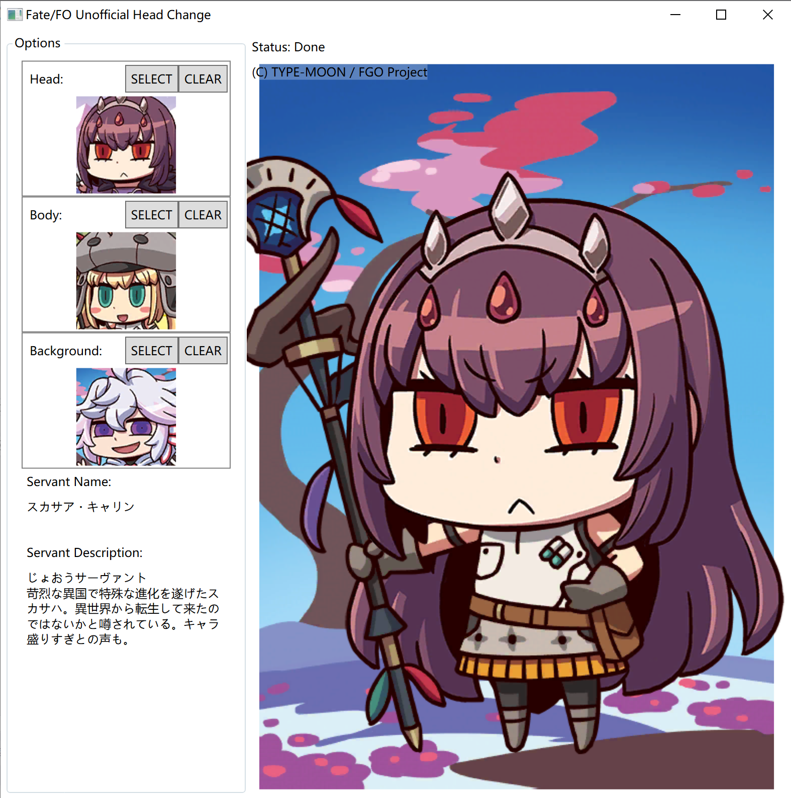

# FfoHeadChange

A re-implementation of head change of Fate/Freedom Order (A game released only on 2021 April Fools' Day), using C# and WPF, rendered by Canvas component.

An overview image:



## Resources

Normally, I do not redistribute any ripped resources (including in-game texts, images, de-compiled codes, etc). Here's the way to get them:

- `ServantDB-Parts.txt` and `ServantDB-Localize.txt` can be obtained from the installation apk file in `assets/bin/Data/data.unity3d` (open apk as zip file), any unity resource extraction tool (like AssetStudio) can extract them.
- The `Head`, `Body` and `Background` (a.k.a. `Land`) images are obtained from `/sdcard/Android/data/com.aniplex.ffobokutoanatanounitesensou/files/Patch/AssetBundles/Combi` after launching the app and downloading the resources (not sure it can be downloaded now since the service is terminated). Use the above tool to extract them. The file name before extraction should like `svh001.abd`, `svb001.abd`, and `svl001.abd`. After extraction it will be `sv001_head_back.png`, `sv001_body_front.png`, `bg_001.png`.
- The `Icon` images are obtained from `/sdcard/Android/data/com.aniplex.ffobokutoanatanounitesensou/files/Patch/AssetBundles/servanticonatlas.abd`, same as above. The extracted file name should like `icon_servant_001.png`.

After extracting all resources, put it into the following place:

```text
.
├── Resource/
│   ├── Icon/
│   │   ├── icon_servant_001.png
│   │   ├── ...
│   │   └── icon_servant_407.png
│   ├── Background/
│   │   ├── bg_001.png
│   │   ├── ...
│   │   └── bg_407.png
│   ├── Body/
│   │   ├── sv001_body_front.png
│   │   ├── ...
│   │   └── sv407_body_middle.png
│   ├── Head/
│   │   ├── sv001_head_back.png
│   │   ├── ...
│   │   └── sv407_head_front.png
│   └── Db/
│       ├── ServantDB-Parts.txt
│       └── ServantDB-Localize.txt
└── FfoHeadChange.exe  # <-- the executable artifact of this project
```

And just run as you want.

